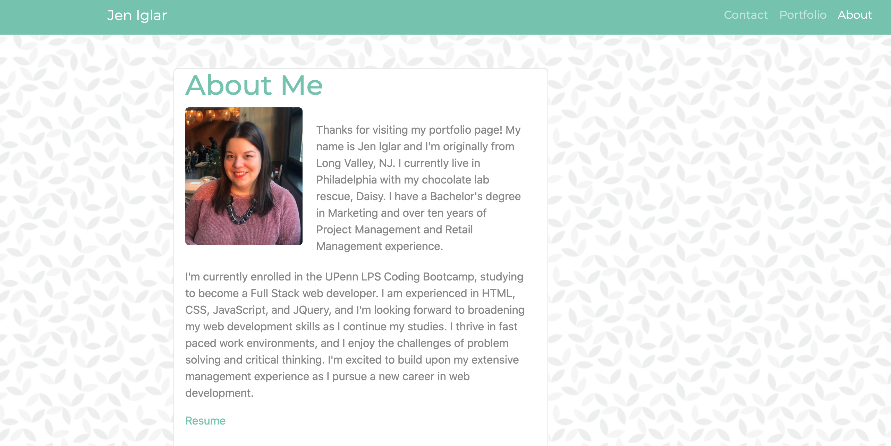

# My Portfolio

</>

For my first web development portfolio, I used the Bootstrap framework to create a professional site with a responsive design intened to render well on a variety of devices. I've included a Navbar that remains consistent throughout each page, as well as a sticky footer. There are 3 pages which include my personal bio and contact information, my portfolio of projects, and a contact form. 

https://jeniglar.github.io/JenIglarPortfolio/

jeniglar@gmail.com
